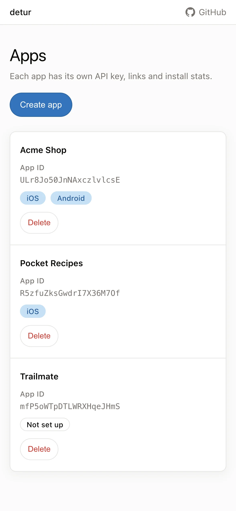
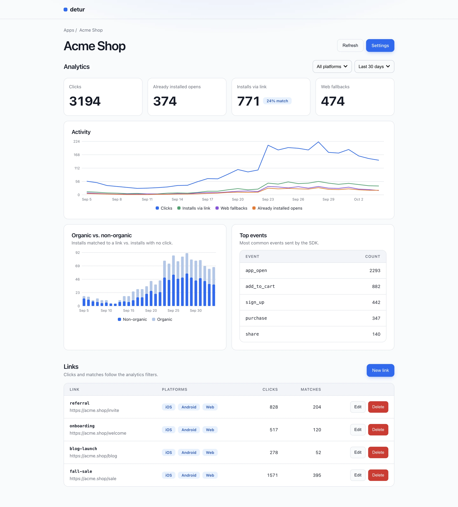
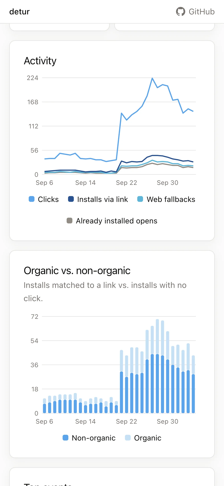
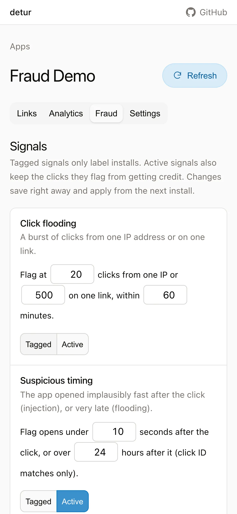
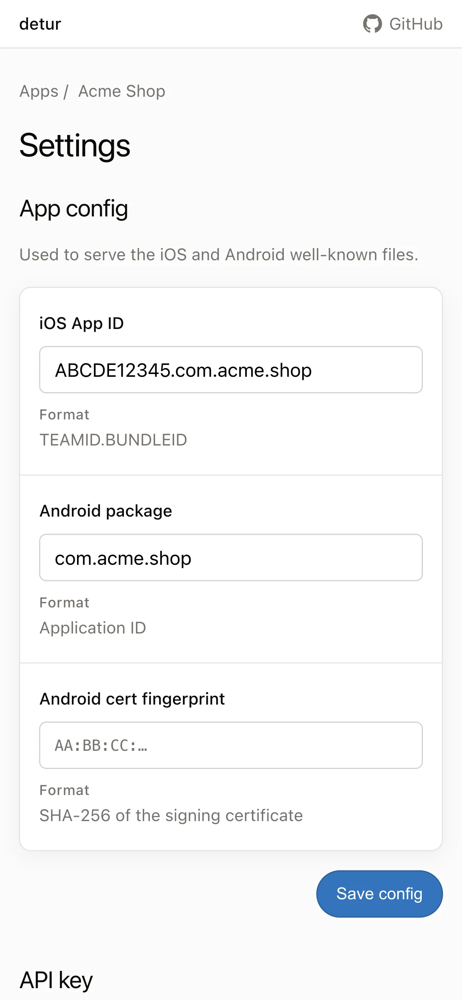

# detur

Self-hosted backend for `@swmansion/react-native-detour`. Drop-in for
[godetour](https://godetour.dev).

Deferred deep links + analytics: tap link → install → first launch opens link. Clicks, installs, events tracked.

- No tiers, no click limits. Your data.
- Same 5 SDK endpoints, same matching.
- One binary: Go + SQLite + Preact portal. No outbound calls.
- Analytics: clicks, installs, events, charts, match quality.
- Fraud: floods, fast opens, bots, datacenter IPs, repeat devices. Tag or block.
- Admin: one password to manage apps. Everyone else: links + stats.

[DECISIONS.md](DECISIONS.md) · [CAVEATS.md](CAVEATS.md)

<table>
  <tr>
    <td width="20%"></td>
    <td width="20%"></td>
    <td width="20%"></td>
    <td width="20%"></td>
    <td width="20%"></td>
  </tr>
  <tr>
    <td align="center">Apps</td>
    <td align="center">Analytics</td>
    <td align="center">Charts</td>
    <td align="center">Fraud</td>
    <td align="center">Settings</td>
  </tr>
</table>

## Comparison (2026-10-07)

| | detur | godetour.dev | AppsFlyer |
|---|---|---|---|
| Hosting | Self-hosted | Hosted | Hosted |
| Price | Free | Tiers | Per volume |
| Click limits | None | Tiered | Volume |
| SDK | Detour. Drop-in for godetour | Detour. Official | AppsFlyer SDK |
| Matching | Detour weights, tuned per app | Detour weights | Proprietary |
| Attribution | 1 click → 1 install | 1 click → 1 install | Multi-touch |
| Analytics | Events tracking | Events tracking | Events tracking, revenue, cohorts |
| Fraud detection | ✅ No click injection | ❌ | ✅ |
| Ad-network / BI integrations | ❌ | ❌ | ✅ |
| Webhooks | ❌ | ✅ | ✅ |
| Platform API | ❌ | ❌ | ✅ |
| Data | Yours | Theirs | Theirs |
| Outbound calls | None | n/a | n/a |

Detour SDK, self-hosted → detur. Detour SDK, hosted → godetour. Multi-touch, click-injection checks, ad networks → AppsFlyer.

## 1. Docker

```text
ghcr.io/anh-ld/detur:latest
```

Prod: pin version (`:0.1.0`).

> **Min:** 1 vCPU, 512 MB, 1 GB disk.

| Env | Required | Default | Description |
|---|---|---|---|
| `DOMAIN` | prod | `localhost` | Links + well-known host |
| `DB_PATH` | no | `/data/detur.db` (Docker), `detur.db` (bare) | SQLite path |
| `RETENTION_HOURS` | no | `24` | Raw click TTL; purged hourly |
| `CLICK_ID_DAYS` | no | `30` (1–90) | Play referrer clickId TTL |
| `TRUST_PROXY` | no | `0` | Trust rightmost XFF / X-Real-IP (real proxy only; else spoofable) |
| `LOGOUT_URL` | no | empty | Gateway sign-out URL; empty hides link |
| `ADMIN_PASSWORD` | no | empty | Admin password; empty = everyone can manage apps |
| `ADMIN_SESSION_HOURS` | no | `12` (1–72) | Admin session length |

| Port | Description |
|---|---|
| `8080` | Public: SDK, links, well-known, `/health` |
| `8081` | Loopback: portal UI + API |

- Health: `GET /health` → `200 ok`.

## 2. Create app

Portal: `:8081`.

- Create app. API key shown once: copy.
- Add links: `/key` → URL, optional iOS / Android / fallback.
- App details: iOS app ID, Android package, cert fingerprint → well-known
  files.
- `ADMIN_PASSWORD` set → app changes need admin (top bar).

## 3. Patch SDK

SDK hardcodes 5 URLs to godetour.dev, no `baseURL`. Layout varies per
version → give your AI agent:

```text
Point the installed @swmansion/react-native-detour at your detur server.

1. Patch node_modules/@swmansion/react-native-detour — BOTH copies:
   src/links/api/* + src/analytics/api/* (TS) and lib/module/*.js (compiled).
2. Replace the five endpoint base URLs with BASE_URL
   (dev: :8080, prod: https://<DOMAIN>). Keep /api/... paths.
3. Verify: grep -r "godetour.dev" node_modules/@swmansion/react-native-detour
   → zero matches. package.json author line is metadata — ignore.
4. Generate: npx patch-package @swmansion/react-native-detour.
5. Survive fresh installs: add "postinstall": "patch-package" to package.json.
6. Report: changed files + patch file path.
```

Example (2.3.1 only, not a pin): [example/patch/](example/patch/).

## 4. Wire app

Full example: [example/expo-app/](example/expo-app/).

`+native-intent.tsx`, add your domain to `hosts`:

```tsx
import { createDetourNativeIntentHandler } from "@swmansion/react-native-detour/expo-router";

export const redirectSystemPath = createDetourNativeIntentHandler({
  fallbackPath: "",
  hosts: ["localhost"], // dev; add deployed domain, e.g. ["links.example.com"]
  config: {
    apiKey: process.env.EXPO_PUBLIC_DETOUR_API_KEY!,
    appID: process.env.EXPO_PUBLIC_DETOUR_APP_ID!,
  },
});
```

- Env: `EXPO_PUBLIC_DETOUR_API_KEY`, `EXPO_PUBLIC_DETOUR_APP_ID` (step 2).
- First launch → match-link → matched link shown.
- Server logs errors only. Clicks/installs: portal analytics.
- Base URL by target: Android emulator `http://10.0.2.2:8080`, device (trusted LAN dev: `-p 8080:8080`, host LAN IP), prod `https://<DOMAIN>`.

## Dev run

```sh
./dev.sh
```

- Portal HMR on `:8000` (auto-runs `npm ci`), Go server reload via [air](https://github.com/air-verse/air).
- Run (2 processes): `cd server && go run ./cmd/detur` · `cd portal && npm i && npm run dev`
- Tests: `cd server && go test ./...` · `cd portal && npm test`

## Credits

- [dub.sh](https://dub.sh): server logic from their link funnel.
- [Detour matching docs](https://detour.swmansion.com/docs/platform/architecture/matching/): weights, threshold, window.
- [@swmansion/react-native-detour](https://github.com/software-mansion-labs/react-native-detour): the SDK.
- [kinu](https://github.com/developit/kinu): portal UI.
