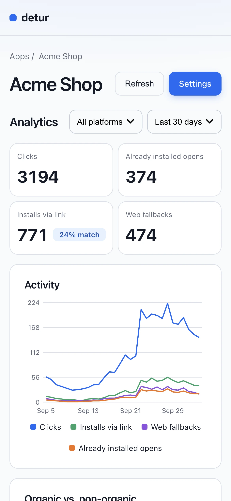

# detur

Self-hosted backend for `@swmansion/react-native-detour`. Drop-in replacement
for hosted [godetour.dev](https://godetour.dev). Deferred deep links on your
own infrastructure: tap short link → install app → first launch opens the
link's destination.


<table>
  <tr>
    <td width="40%"></td>
    <td width="40%"></td>
    <td width="20%"></td>
  </tr>
  <tr>
    <td align="center">Apps</td>
    <td align="center">Settings</td>
    <td align="center">Mobile</td>
  </tr>
</table>

## Why detur?

- No pricing tiers, no click limits. Your server, your data.
- Drop-in: same five SDK endpoints, same matching. Point the app at your domain.
- One binary: Go + SQLite + portal. No external services, no outbound calls.

## Quick start

### 1. Run the server

```sh
docker run -d --name detur --restart unless-stopped \
  -p 127.0.0.1:8080:8080 \
  -p 127.0.0.1:8081:8081 \
  -v detur-data:/data \
  -e DOMAIN=links.example.com \
  ghcr.io/anh-ld/detur:latest
```

| Env | Default |
|---|---|
| `DOMAIN` | `localhost` |
| `DB_PATH` | `/data/detur.db` (Docker), `detur.db` (bare run) |
| `RETENTION_HOURS` | `24` |
| `TRUST_PROXY` | `0` |

- Minimum instance: 1 vCPU, 512 MB RAM, 1 GB disk.
- Only `DOMAIN` required. Override the rest with `-e NAME=value`.
- Production: pin a version (`ghcr.io/anh-ld/detur:0.1.0`), not `latest`.
- Build from source: `docker build -t ghcr.io/anh-ld/detur:latest .`.
- Health check: `GET /health` → `200 ok`.
- No Docker: `cd server && go run ./cmd/detur`.
- Dev: `./dev.sh`. Portal HMR on `:8000`, server rebuilds on `.go` change via [air](https://github.com/air-verse/air). Ctrl-C stops both.
- Production: publish `8080` on loopback behind a TLS reverse proxy.
- `TRUST_PROXY=1` only behind a real proxy. Trusts rightmost
  `X-Forwarded-For` entry (the peer the proxy saw), else `X-Real-IP`. Proxy
  must append to `X-Forwarded-For`, or overwrite `X-Real-IP` if it sets no
  XFF. Without a proxy, direct callers spoof the IP match signal.

### 2. Create an app in the portal

Open `http://127.0.0.1:8081`:

- Create an app. API key shows once: copy it then.
- Add links (`/key` → URL), optional iOS, Android, fallback URLs.
- Set app details (iOS app ID, Android package, certificate fingerprint).
  Server builds the well-known files from them.

### 3. Patch the SDK

SDK hardcodes its five endpoint URLs to [godetour.dev](https://godetour.dev),
no `baseURL` config field. File layout changes per SDK version, so give this
prompt to your AI agent. It patches whichever version you installed.

**Patch prompt (paste to your AI agent):**

```text
Point the installed @swmansion/react-native-detour at your detur server.

1. Patch node_modules/@swmansion/react-native-detour — BOTH copies:
   src/links/api/* + src/analytics/api/* (TS) and lib/module/*.js (compiled).
2. Replace the five endpoint base URLs with BASE_URL
   (dev: http://localhost:8080, prod: https://<DOMAIN>). Keep /api/... paths.
3. Verify: grep -r "godetour.dev" node_modules/@swmansion/react-native-detour
   → zero matches. package.json author line is metadata — ignore.
4. Generate: npx patch-package @swmansion/react-native-detour.
5. Survive fresh installs: add "postinstall": "patch-package" to package.json.
6. Report: changed files + patch file path.
```

- [example/patch/@swmansion+react-native-detour+2.3.1.patch](example/patch/@swmansion+react-native-detour+2.3.1.patch):
  worked example, SDK 2.3.1 only.
- Shows what the patch looks like. Not a version pin; your version may differ.

### 4. Wire up the app

Full example: [example/expo-app/](example/expo-app/). Worked patch:
[example/patch/](example/patch/).

In `+native-intent.tsx`, list your domain in the host matcher:

```tsx
import { createDetourNativeIntentHandler } from "@swmansion/react-native-detour/expo-router";

export const redirectSystemPath = createDetourNativeIntentHandler({
  fallbackPath: "",
  hosts: ["localhost"], // dev; add deployed domain, e.g. ["links.example.com"]
  config: {
    apiKey: process.env.EXPO_PUBLIC_DETOUR_API_KEY!,
    appID: process.env.EXPO_PUBLIC_DETOUR_APP_ID!,
  },
});
```

- Set `EXPO_PUBLIC_DETOUR_API_KEY` and `EXPO_PUBLIC_DETOUR_APP_ID` from step 2.
- Run the app. First launch calls match-link, shows the matched link.
- Server logs only errors; check the portal analytics for clicks and installs.
- Android emulator: `http://10.0.2.2:8080`.
- Physical device: deployed domain.
- Dev on a trusted LAN only: publish `8080` on the host interface
  (`-p 8080:8080`), use the host's LAN IP.
- Production: `https://<DOMAIN>` through the TLS proxy.

## Credits

- [dub.sh](https://dub.sh) (dubinc/dub): server logic cloned from their
  production deep-link funnel.
- [Detour matching docs](https://detour.swmansion.com/docs/platform/architecture/matching/):
  probabilistic matching weights, threshold, window.
- Which source wins where: [DECISIONS.md](DECISIONS.md).
- Software Mansion: [@swmansion/react-native-detour](https://github.com/software-mansion-labs/react-native-detour), the SDK this server serves.
- [kinu](https://github.com/developit/kinu) (developit): portal UI toolkit.

Known limits: [CAVEATS.md](CAVEATS.md).
