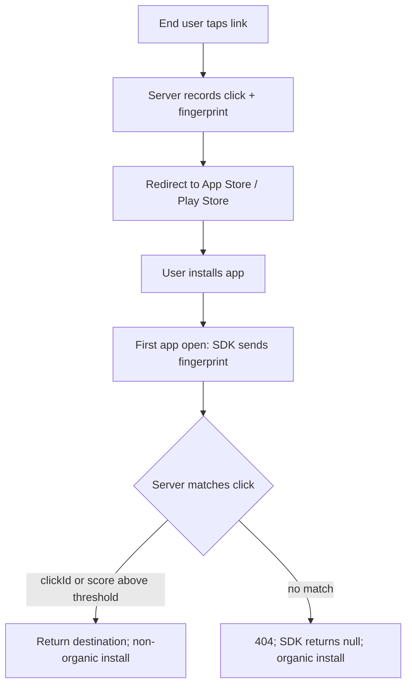
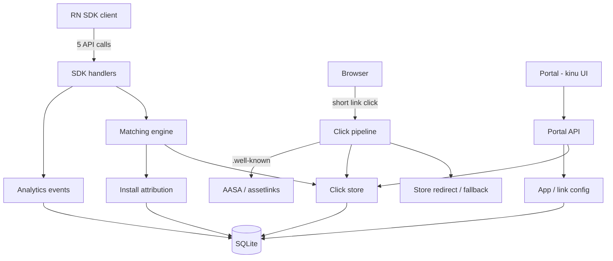
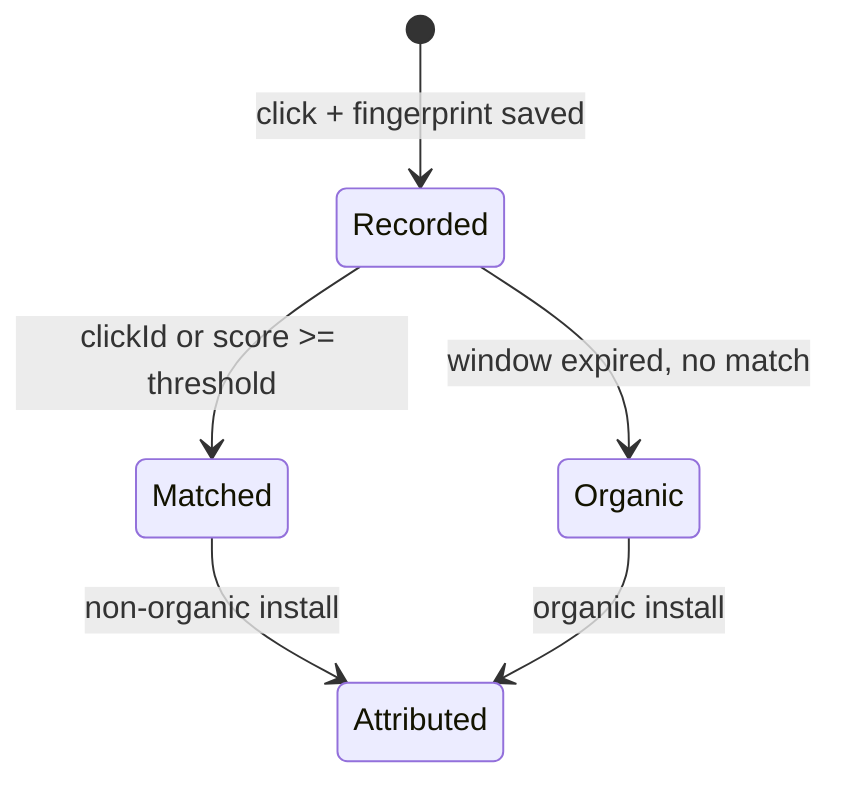

# Self-Hosted Detour Server - Plan

## Goal Capsule

- **Objective:** Self-hosted, Dockerized drop-in replacement for godetour.dev — Go + SQLite server serving react-native-detour SDK's five calls + click → install → open pipeline + thin portal — so owner's RN apps run deferred deep links on own infra, others self-host same way.
- **Means:** Go + pure-Go SQLite + kinu portal; client patch via patch-package; logic cloned from Dub's production deep-link funnel; no portal auth — zero-trust boundary. (KTD1–KTD5)
- **Product authority:** Self-host first, OSS later. v1 = engine + thin portal. Single instance, no multi-tenancy.
- **Open blockers:** None. Outstanding items deferred to planning.

---

## Product Contract

Product Contract preserved; amended — KD4 → clone Dub logic 100%, ADD KD6 + R19 (portal no built-in auth), UI stack → kinu (KTD3).

### Summary

Self-hosted godetour.dev replacement: Go + SQLite server answering Detour SDK's five calls + running deferred deep-link pipeline (short links, click recording, matching, store redirects, well-known files), plus thin kinu portal managing apps/links + click/install readout. SDK pointed via patch-package patch. Dockerized, deploy anywhere. Logic cloned from Dub's production deep-link funnel.

### Problem Frame

godetour.dev caps usage (Free 1.5k clicks/mo, 50 short links; Starter $19; overage + click blocking), gates custom domains/webhooks behind paid tiers, hosts all config + traffic on Software Mansion cloud. SDK endpoints hardcoded to godetour.dev, no base-URL config. Self-host = enterprise-only custom pricing. No self-host path for teams wanting own infra.

### Key Decisions

- KD1. **v1 = engine + thin portal**, not engine-only or parity (session-settled: user-directed — chosen over engine-only + parity: only shape serving all four success signals). Governs R14, R15.
- KD2. **Client via patch-package + docs**, not forked package (session-settled: user-directed — chosen over fork: track upstream releases, users apply five-constant patch). Governs R13.
- KD3. **Click limits answer "no limit"** (session-settled: user-approved — over billing enforcement: SDK reads response shape only; plan semantics pointless when you own server). Governs R3.
- KD4. **Server logic CLONE 100% from Dub's deep-link funnel** (session-settled: user-directed — "learn from dub.sh", production-proven: deferred click→install→open pipeline, click-cache, probabilistic IP matching, interstitial = closest working reference; mapping verified against dubinc/dub source). Governs R5–R10, R15.
- KD5. **Single self-host instance; no multi-tenancy, billing, SSO in v1** (user-approved). Governs R14, R16.
- KD6. **Portal NO built-in auth** (session-settled: user-directed — chosen over built-in login: trust at network boundary, zero-trust service if needed). Governs R19.

### Requirements

**SDK contract fidelity**

- R1. Server answers five RN SDK calls — match-link, resolve-short, universal-link-click, analytics event, analytics retention — godetour.dev-compatible request/response/error semantics.
- R2. Matching follows 404 = no-match convention: unmatched fingerprint → 404, SDK returns null, install organic.
- R3. Server honors SDK fail-open contract: transport/backend errors never deny link; explicit deny only blocker. Match-link backend error → 404/no-match, logged as unknown (distinct from organic). Click-limit responses carry SDK-read fields (clicksInPeriod, effectiveLimit, code) with "no limit" answer.
- R4. Requests authenticated against SDK header contract (Bearer apiKey, X-App-ID, X-SDK); invalid credentials rejected with SDK-visible error.

**Deferred matching and attribution**

- R5. Deterministic match wins: clickId from Android Play referrer or explicit clickId resolves recorded click directly.
- R6. Probabilistic match follows documented scoring contract: weights IP 500, model+system version 450 (Android), iOS system version 350, user-agent device signature 350, pasteboard 350/175, timezone 200, screen 200, language 100; default threshold 850, configurable 700–1200; default window 15 min, configurable 5–180; ties → newer click. Only one device signal scored per candidate (model+system version on Android when browser supplies both; iOS system version from click user-agent; user-agent device signature only as fallback) — documented maxima 1700 iOS / 1450 Android.
- R7. Matching records attribution: matched click → non-organic install; unmatched first launch → organic install.
- R8. Server persists click-time fingerprint (IP, device, locale, timezone, screen, user-agent, pasted link), matches against first-launch fingerprint.

**Browser pipeline**

- R9. Short links served from self-host domain record click + device fingerprint at click time.
- R10. Redirects follow platform contract: mobile → App Store / Google Play (Android keeps Play click-ID), desktop → fallback URL.
- R11. Server hosts `.well-known/apple-app-site-association` + `assetlinks.json` per app — Universal/App links resolve under self-host domain.
- R12. Custom domains configurable; pipeline (links, redirects, well-known files) works under configured domain.

**Client integration**

- R13. Patch-package patch repointing five hardcoded endpoint constants published with apply instructions; app code untouched.

**Portal and management**

- R14. Portal manages apps + links, per-link matching settings (threshold, window), API keys.
- R15. Portal shows per-link and per-app readout: clicks, attributed non-organic installs, organic installs.
- R19. Portal requires no built-in authentication; access control delegated to external zero-trust service at network boundary.

**Deployment and configuration**

- R16. Server ships as Docker image, starts with one command, persisted on SQLite, no external service dependency.
- R17. Deployment configurable via environment/config: domain(s), ports, link host — deploys anywhere.
- R18. Data stays on operator infrastructure; nothing phones home to godetour.dev or third party.

### Actors

- A1. **Self-host operator** — deploys/configures server; creates apps, links, API keys; reads analytics.
- A2. **App end-user** — taps Detour link; installs app; opens first time.
- A3. **RN SDK client** — patched react-native-detour build; calls five endpoints.

### Key Flows

- F1. **Deferred deep link (new install)**
  - **Trigger:** End-user taps short link before installing app.
  - **Actors:** A2, A3, A1's server.
  - **Steps:** Server records click + fingerprint; redirects to store; user installs + opens app; SDK sends first-launch fingerprint to match-link; server matches deterministically (clickId) or probabilistically (score ≥ threshold within window); returns destination URL.
  - **Outcome:** App navigates to destination; install non-organic. No match: 404, SDK null, install organic. Covers R2, R5–R9.



- F2. **Universal / App link (existing user)**
  - **Trigger:** End-user taps Universal/App link, app installed.
  - **Actors:** A2, A3.
  - **Steps:** SDK reports click to universal-link-click; resolve-short maps URL to destination.
  - **Outcome:** App opens at destination; click recorded. Covers R1, R3, R9.

### Acceptance Examples

- AE1. **Deferred match success.** Given first-time iOS user clicked link, installed, opened within window, when SDK sends fingerprint, server returns clicked link destination + marks install non-organic. Covers R5–R8.
- AE2. **Organic no-match.** Given fresh first launch, no prior click for fingerprint, when match-link called, server returns 404, SDK null, install organic. Covers R2, R7.
- AE3. **Fail-open.** Given server unreachable at click time, SDK universal-link-click still allows link, app keeps working. Covers R3.
- AE4. **Android deterministic path.** Given Play referrer clickId on install, deterministic match wins regardless of probabilistic score. Covers R5.
- AE5. **Custom domain.** Given configured self-host domain, short links resolve, redirects work, AASA/assetlinks reachable; app host matcher updated client-side. Covers R11, R12.

### Success Criteria

- Owner's own RN app runs deferred deep links in production on self-hosted server, zero app-code changes.
- Server covers same job godetour.dev did for project like owner's.
- Second person/team self-hosts, works for them.
- OSS traction: strangers file real issues/PRs or adopt. (Audience unvalidated — assumption.)

### Scope Boundaries

**Deferred for later**

- Platform API (api.godetour.link-style management API)
- Webhooks (scheduled signed payloads)
- Billing / plan click-limit enforcement
- Multi-tenant organizations, SSO
- Full analytics (30-day retention views, smart banners, custom HTML redirect/copy-link pages)
- Native iOS / Android / Flutter client patches (RN only v1)

**Deferred to Follow-Up Work**

- Upstream PR: add base-URL config field to Detour SDK — would retire patch. DEFER until server proven.
- Rate limiting on SDK endpoints.

**Outside this product's identity**

- Not hosted/competing cloud service
- Not general-purpose feature-flag, deep-link, or analytics platform — protocol-compatible with Detour's data model
- Portal authentication — delegated to zero-trust boundary (Tailscale, Cloudflare Access, etc.), never built-in

### Dependencies / Assumptions

**Dependencies**

- react-native-detour SDK upstream — patch pinned to version (contract has no stability statement)
- Detour documented matching + click-handling contract
- Owner's own RN app(s) as first deployment

**Assumptions**

- OSS audience unvalidated — "me" only evidence; v1 scoped to owner's needs
- IP extraction from request headers + traffic-quality filtering unspecified in Detour docs — derive; bot filtering cloned from Dub's record-click
- Kinu early-stage (small component set) — pin version; fallback plain HTML if gap
- SDK contract stays patchable against pinned version; upstream changes tracked via patch updates

### Outstanding Questions

**Resolve Before Planning**

- None.

**Deferred to Planning**

- Exact SDK version to pin patch (research time: v2.3.1)
- Redirect page markup — default pages v1
- IP extraction + traffic-filtering details
- Kinu version pin

### Sources / Research

- Detour docs — matching contract: detour.swmansion.com/docs/platform/architecture/matching/ (weights, threshold, window); click handling: /docs/platform/architecture/click-handling/; billing: /docs/platform/fundamentals/billing/; dashboard: /docs/platform/fundamentals/dashboard/; API management: /docs/platform/advanced/api-management/; SDK usage: /docs/sdk/react-native/sdk-usage/.
- SDK source v2.3.1 (software-mansion-labs/react-native-detour) — five endpoint constants hardcoded to godetour.dev (packages/react-native-detour/src/links/api/*, src/analytics/api/*); Config type no base-URL field (src/links/types/index.ts).
- godetour.dev pricing + self-host stance: detour.swmansion.com.
- Dub reference (dubinc/dub, verified 2026-09-28): apps/web/app/(ee)/api/track/open/route.ts (deep-link open tracking), apps/web/lib/middleware/utils/cache-deeplink-click-data.ts (click cache), apps/web/lib/middleware/link.ts (store-URL interception + interstitial redirect), apps/web/app/app.dub.co/(deeplink)/deeplink/[domain]/[[...key]]/page.tsx (interstitial; AASA/assetLinks), apps/web/lib/tinybird/record-click.ts (bot checks).
- Kinu (developit): github.com/developit/kinu — hyper-minimal Preact UI toolkit, ~5KB JS + 6KB CSS, MIT.
- Session research artifacts: grounding.md + verification.md at /tmp/compound-engineering-501/ce-brainstorm/detur-server-20260928-1416/ (session scratch, may be cleaned).

---

## Planning Contract

### Key Technical Decisions

- KTD1. **Pure-Go SQLite driver (modernc.org/sqlite)** — chosen over cgo driver (mattn): no C toolchain → static binary, clean multi-arch Docker builds, single deployable. External research (context7) confirms maturity + cross-platform. Governs R16.
- KTD2. **Stdlib routing (net/http, Go 1.22+ method patterns)** — no framework dependency; five endpoints + portal API fit plain handlers. Governs R1, R14.
- KTD3. **Portal UI = kinu** (session-settled: user-directed — user named github.com/developit/kinu: minimal Preact toolkit, 5KB, themeable; fits thin portal). Governs R14, R15.
- KTD4. **Dub clone map** (session-settled: user-directed — "clone 100% server logic from dub.sh", production-proven): click recording + bot filter ← Dub record-click; open-tracking semantics ← /api/track/open; redirect + interstitial logic ← link.ts middleware + DeepLinkPreviewPage; well-known hosting ← page.tsx shortDomain reads. Click cache NOT cloned as a separate layer: Dub's deepLinkClickCache (fixed 1h TTL, keyed ip:domain:key, retrieved by device IP — verified cache-deeplink-click-data.ts) does not map to Detour's match-link contract (clickId lookup or fingerprint scan); matching reads the persisted clicks table, with retention = max(configured window, 24h floor) and deterministic lookup exempt from the window. Adapted to Go; logic identical where the model maps. Governs R5–R10, R15.
- KTD5. **No portal auth — zero-trust boundary** (session-settled: user-directed — over built-in login: deploy behind Tailscale/Cloudflare Access; app adds nothing). Mechanism pinned: portal (API + static UI) on separate listener; in-container bind 0.0.0.0, docker compose publishes portal port on host loopback only (127.0.0.1:PORT:PORT); strict loopback bind for non-container deploys; zero-trust service terminates portal route only; SDK endpoints stay public. Governs R19.
- KTD6. **Patch pinned to SDK version at research time (v2.3.1)** — contract carries no stability statement; pin + update patch on releases. Governs R13.

### High-Level Technical Design

Component topology — Go server one binary, SQLite persistence, kinu portal, browser + SDK entry points.



Click lifecycle — recorded → window open → matched / organic.



### Output Structure

```
detur/
├── server/                 # Go module
│   ├── cmd/detur/          # main, entrypoint
│   ├── internal/
│   │   ├── api/            # SDK endpoints + portal API
│   │   ├── match/          # scoring engine
│   │   ├── pipeline/       # click, redirect, well-known
│   │   └── store/          # sqlite, schema
├── portal/                 # Preact + Vite + kinu
├── patch/                  # patch-package patch + apply docs
├── example/                # RN example app (patch consumer)
├── docker/                 # Dockerfile, compose, env template
├── plans/                  # dev artifacts: plan, dossier pointers
└── README.md
```

### Assumptions

- OSS audience unvalidated; v1 for owner.
- IP extraction + traffic filtering derived; bot filter cloned from Dub.
- Kinu pinned; plain HTML fallback if gap.
- Patch tracks pinned SDK version.

### Sequencing

U1 → U2 → U3 → U4 → U5 → U6 → U7 → U8. U7 parallelizable after U3; U8 last.

### System-Wide Impact

- **Data lifecycle:** clicks hold device fingerprints + pasted links (R8) — expires_at + purge (U1) default; retention setting operator-controlled. Events raw data same treatment.
- **Auth boundary:** SDK endpoints public (device traffic); portal on separate listener, host-loopback published in Docker, zero-trust terminates portal route only (KTD5). TLS termination = deployment requirement — bearer apiKey + fingerprints never sent over plain http. Portal exposure = API-key exfiltration + redirect retargeting — documented blast radius.
- **Attribution integrity:** installs unique on (device hash, clickId) — duplicate match-link idempotent (U1, U3).

### Risk Analysis & Mitigation

- **SDK contract drift** — pin patch version; contract tests encode request/response shapes. MITIGATE: test-first contract suite.
- **Matching quality gap** (IP extraction unspecified) — configurable threshold/window; Dub bot-filter clone. MITIGATE: unit + integration tests.
- **Kinu early-stage** — pin version, small surface, plain HTML fallback. MITIGATE: minimal component usage.
- **godetour.dev docs drift** — dossier pinned 2026-09-28; contract tests are source of truth.

---

## Implementation Units

### U1. Scaffold + store + config

- **Goal:** Go module, SQLite schema, env config, entrypoint.
- **Requirements:** R16–R18.
- **Dependencies:** none.
- **Files:** server/go.mod, server/cmd/detur/main.go, server/internal/config/config.go, server/internal/config/config_test.go, server/internal/store/store.go, server/internal/store/schema.sql, server/internal/store/store_test.go
- **Approach:** KTD1 driver; WAL mode; schema — apps, links, clicks, installs, events, settings. API keys stored hashed (SHA-256), full key shown once at creation, masked after. Clicks carry expires_at (max of configured window, 24h floor) + link key + destination; deterministic clickId lookup exempt from window filter (documented Detour contract: deterministic match has no window). Installs attribution ∈ organic | non-organic | unknown (R3 backend-error path); installs unique on (device hash, clickId) — duplicate match-link idempotent; unknown logged, not surfaced in readout (R15). clicks(created_at) index for windowed scan + tie-break. Purge: startup janitor + on-read sweep removes expired rows; retention setting configurable. Config env: DOMAIN, PORT, DB_PATH. Entrypoint: config → store → serve.
- **Test scenarios:**
  - Store CRUD: create app, link, click, install; read back.
  - Click insert + fingerprint persisted verbatim.
  - Install attribution update (non-organic/organic).
  - Backend-error match-link writes unknown attribution row; excluded from readout.
  - Expired click purged by janitor (retention floor respected).
  - Duplicate install upsert → single row.
  - Config defaults apply when env absent.
  - Invalid config → fail fast, clear error.
- **Verification:** go build ./... ; go test ./internal/store ./internal/config.

### U2. Matching engine

- **Goal:** Deterministic clickId match + probabilistic scoring per documented weights.
- **Requirements:** R5–R8. Covers AE1, AE2, AE4.
- **Dependencies:** U1.
- **Files:** server/internal/match/score.go, server/internal/match/window.go, server/internal/match/match.go, server/internal/match/match_test.go
- **Approach:** Deterministic first (R5); probabilistic fallback (R6) — weights, threshold, window from R6; ties → newer; no match → 404/organic (R7). Candidate scope (per-link vs window scan) + match-link request schema enumerated FIRST in this unit from the pinned SDK source; scoring follows. Configurable threshold/window (R14 settings).
- **Test scenarios:** (~20 focused, high-value)
  - Exact clickId resolves regardless of score. Covers AE4.
  - Score above threshold → match; returns link. Covers AE1.
  - Score below threshold → no match. Covers AE2.
  - Score exactly at threshold → match (boundary).
  - Window edge: click at 14:59 vs 15:00 min — match/no-match.
  - Window max 180 min respected.
  - Window 180: click at T, match attempt T+179 min succeeds (clicks table, not cache).
  - Deterministic clickId lookup succeeds beyond window (24h retention floor).
  - Tie (equal score) → newer click wins.
  - Android weights: model+OS 450 counted; iOS OS 350 path.
  - Pasteboard tier 350 (token+prefix) vs 175 (prefix only).
  - Screen tolerance ±1 width/height, ±0.01 scale.
  - Missing signals → partial score, no panic.
  - Max totals 1700 iOS / 1450 Android sanity.
  - Threshold 700 min / 1200 max clamped.
- **Verification:** go test ./internal/match.

### U3. SDK API endpoints

- **Goal:** Five endpoints, godetour.dev-compatible shapes; auth headers; fail-open; 404.
- **Requirements:** R1–R4.
- **Dependencies:** U2.
- **Files:** server/internal/api/sdk.go, server/internal/api/sdk_test.go
- **Approach:** KTD2 routes; header validation (R4); fail-open (R3, KD3); response fields clicksInPeriod/effectiveLimit/code; 404 no-match (R2); analytics event + retention persisted (R8 store). Contract suite: re-verify match-link request schema (link identity + fingerprint fields) enumerated in U2 against pinned SDK source — feeds U4 click row.
- **Test scenarios:**
  - match-link: valid fingerprint → match/404 shapes. Covers AE1, AE2.
  - match-link: backend error → 404/no-match + logged unknown. Covers AE3 path.
  - match-link: duplicate call → one attribution row, first result returned.
  - match-link: invalid apiKey → SDK-visible error.
  - resolve-short: valid URL → link/route/parameters; unknown → 404/null.
  - universal-link-click: fail-open on DB error (allowed:true). Covers AE3.
  - universal-link-click: deny shape never sent in v1 (no-limit fields present).
  - analytics event: accepted, persisted.
  - analytics retention: accepted, persisted.
  - Missing X-App-ID → error shape.
- **Verification:** go test ./internal/api; curl against local server.

### U4. Browser pipeline

- **Goal:** Short-link serving, click recording + fingerprint, store redirects, desktop fallback.
- **Requirements:** R9, R10.
- **Dependencies:** U1, U3.
- **Files:** server/internal/pipeline/click.go, server/internal/pipeline/redirect.go, server/internal/pipeline/pipeline_test.go
- **Approach:** Clone Dub link.ts semantics (KD4): store-URL detection → record click (link key + destination + fingerprint, R8) in clicks table; 302 redirect — mobile → App Store/Play (Android click-ID passthrough), desktop → fallback; bot filter cloned from Dub record-click; reserved params ppid/dtb pass through.
- **Test scenarios:**
  - iOS click → App Store redirect + click recorded.
  - Android click → Play redirect + clickId passthrough.
  - Desktop click → fallback URL.
  - Fingerprint captured + persisted at click time. Covers AE1 path.
  - Bot UA skipped (no click recorded).
  - Malformed/unknown link → fallback, no crash.
  - ppid/dtb params preserved on redirect.
- **Verification:** go test ./internal/pipeline; curl -I checks.

### U5. Well-known + custom domains

- **Goal:** AASA + assetlinks per app; custom domain support.
- **Requirements:** R11, R12. Covers AE5.
- **Dependencies:** U1, U4.
- **Files:** server/internal/pipeline/wellknown.go, server/internal/config/domains.go, server/internal/pipeline/wellknown_test.go
- **Approach:** Serve /.well-known/apple-app-site-association (applinks, JSON content-type) + assetlinks.json per app (R11); domain config drives host routing (R12, R17).
- **Test scenarios:**
  - AASA valid JSON per app, correct applinks entry.
  - assetlinks.json valid per app.
  - Unknown domain → 404.
  - Custom domain serves short links + redirects. Covers AE5.
- **Verification:** go test ./internal/pipeline; curl -I well-known paths.

### U6. Portal (kinu)

- **Goal:** Thin portal: apps/links CRUD, matching settings, analytics readout; no auth.
- **Requirements:** R14, R15, R19.
- **Dependencies:** U3, U4.
- **Files:** portal/ (package.json, vite config, src/ — app shell, apps page, links page, settings, readout), server/internal/api/portal.go, server/internal/api/portal_test.go
- **Approach:** KTD3 kinu components; KTD5 no auth (R19) — portal API + static UI on separate listener; portal API rejects cross-origin requests (Origin/Host validation against loopback/configured host); portal API routes: apps/links CRUD, settings persist (threshold/window), readout from click/install store (R15); static build served by Go binary.
- **Test scenarios:**
  - Portal API: create/update/delete app + link.
  - Matching settings persisted + applied by matching engine (U2).
  - Readout numbers correct: recorded click → matched → non-organic count; unmatched → organic. Covers AE1, AE2.
  - Portal serves without auth; API rejects nothing on identity (no-auth contract, R19).
  - Cross-origin form POST to portal API rejected (Origin/Host guard).
  - Portal build passes; shell renders.
- **Verification:** portal build; go test ./internal/api; manual browser smoke.

### U7. Client patch + example app

- **Goal:** Patch-package patch (five constants), example app, apply docs.
- **Requirements:** R13.
- **Dependencies:** U3.
- **Files:** example/patch/, example/expo-app/ (RN app: useDetour wiring, +native-intent host), README.md section 3
- **Approach:** KTD6 — patch pinned to SDK v2.3.1; repoint five URL constants to https DOMAIN; example app exercises match, resolve, universal-link-click, analytics.
- **Test scenarios:**
  - Patch applies clean to fresh pinned SDK install.
  - Example app runs against local server, full deferred flow. Covers AE1.
  - No-match path returns null, app navigates default. Covers AE2.
  - Docs follow apply steps exactly.
- **Verification:** fresh install + patch-package apply; example app + local server integration.

### U8. Docker + guide doc

- **Goal:** Docker image, one-command deploy, README + guide (telegraphic).
- **Requirements:** R16–R18.
- **Dependencies:** U1–U7.
- **Files:** docker/Dockerfile (multi-stage, static, non-root), docker/docker-compose.yml, docker/.env.example, README.md (unified user guide)
- **Approach:** KTD1 no-cgo → scratch/alpine static image; env config (R17); no secrets in image; non-root container; healthcheck; volume for SQLite persistence (R16); compose publishes portal port on host loopback only (127.0.0.1:PORT:PORT, KTD5); TLS termination = deployment requirement (reverse proxy/Caddy or in-process certs) — .env.example defaults to https; README + guide telegraphic, structured (user directive).
- **Test scenarios:**
  - Docker build succeeds (multi-arch).
  - Compose up: healthcheck green, endpoints respond, well-known served.
  - SQLite persists across container restart.
  - Portal port published on host loopback only; SDK endpoints public.
  - Plain-http deployment refused or redirected; https serves SDK endpoints + well-known.
  - Guide documents portal exposure blast radius (keys + redirects retargetable) — delegation is informed operator choice.
- **Verification:** docker compose up + smoke script; restart persistence check.

---

## Verification Contract

- `go test ./...` — server units + contract tests.
- `go vet ./...` — static checks.
- Portal: `npm run build` — kinu UI builds.
- `docker build` + `docker compose up` — deploy smoke.
- Example app: patch apply + local-server integration.
- Test budget: focused, high-value (~20 per critical area), no 100% coverage goal. SKIP low-ROI surfaces: pure enums/consts, static templates.

---

## Definition of Done

- All units verified per unit Verification fields.
- `go test ./...` green; portal build green; docker smoke green.
- Example app end-to-end: deferred match + organic + fail-open proven against local server.
- Patch applies to pinned SDK version.
- README + guide: telegraphic, structured, straight.
- CLEANUP: dead/experimental code from abandoned approaches removed before done — not left in diff.